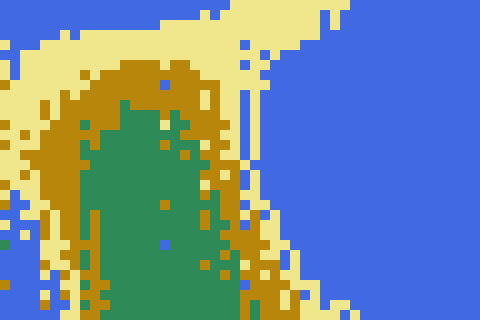
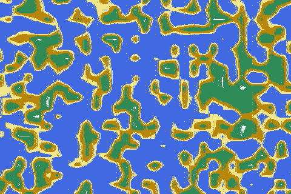
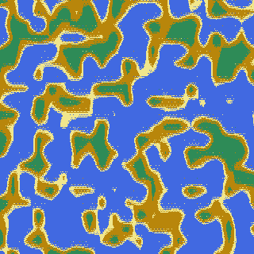
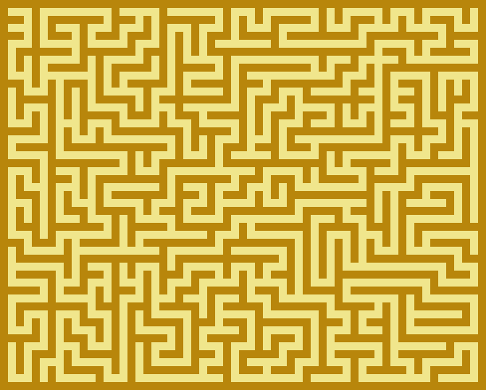
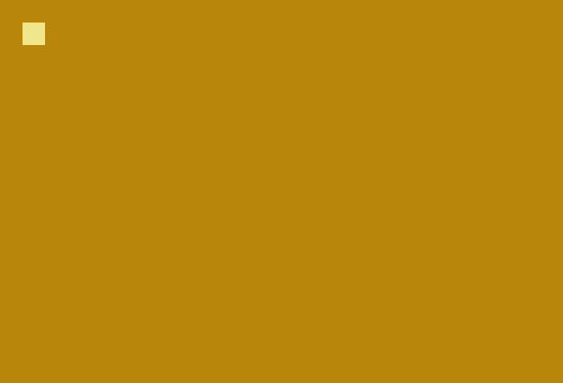
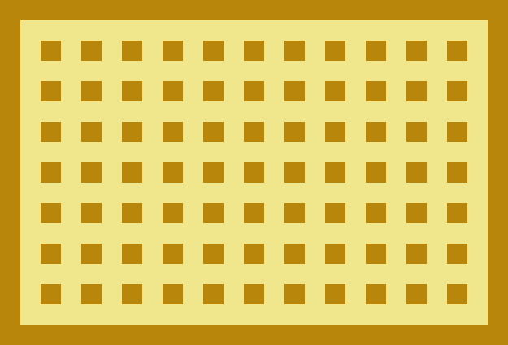

# Biome
Biome is a plane world generation tool written in Go (Golang).

# Installation
Installation is done using `go get`.
```
go get -u github.com/tomowarkar/biome
```

# Godoc
https://godoc.org/github.com/tomowarkar/biome

# Quick start
```
# assume the following codes in example.go file
$ cat example.go

# run example.go
$ go run example.go
```
### flactal
```go
package main

import (
	"image/color"
	"time"

	"github.com/tomowarkar/biome/fractal"
)

var (
	sea    = color.RGBA{65, 105, 225, 255}
	beach  = color.RGBA{240, 230, 140, 255}
	island = color.RGBA{184, 134, 11, 255}
	forest = color.RGBA{46, 139, 87, 255}
	snow   = color.RGBA{255, 255, 255, 255}
)

func main() {
	seed := time.Now().UnixNano()
	world := fractal.Flactal(320, 480, seed)

	var palette []color.Color

	for i := 0; i < 256; i++ {
		if i < 150 {
			palette = append(palette, sea)
		} else if i < 160 {
			palette = append(palette, beach)
		} else if i < 190 {
			palette = append(palette, island)
		} else if i < 240 {
			palette = append(palette, forest)
		} else {
			palette = append(palette, snow)
		}
	}

	world.ToPng("image", 1, palette)
}
```
### maze
```go
package main

import (
	"image/color"
	"time"

	"github.com/tomowarkar/biome/maze"
)

func main() {
	mazeWidth, mazeHeight := 37, 27
	m := maze.NewMaze(mazeHeight, mazeWidth)
	seed := time.Now().UnixNano()

	palette := []color.Color{
		color.RGBA{184, 134, 11, 255},
		color.RGBA{240, 230, 140, 255},
		color.RGBA{255, 0, 255, 255},
	}

	m.StickDown(seed)
	m.Solve()
	m.ToPng("maze1", 10, palette)

	m.Digging(seed)
	m.Solve()
	m.ToPng("maze2", 10, palette)
}
```
### gif
```go
package main

import (
	"image/color"
	"time"

	"github.com/tomowarkar/biome/maze"
)

func main() {
	w, h := 61, 49
	m := maze.NewMaze(h, w)
	var datas [][]int

	for i := 0; i < 10; i++ {
		seed := time.Now().UnixNano()
		m.StickDown(seed)
		datas = append(datas, m.Data())
		m.Solve()
		datas = append(datas, m.Data())
		m.Digging(seed)
		datas = append(datas, m.Data())
		m.Solve()
		datas = append(datas, m.Data())
	}

	palette := []color.Color{
		color.RGBA{184, 134, 11, 255},
		color.RGBA{240, 230, 140, 255},
		color.RGBA{255, 0, 255, 255},
	}

	maze.ToGif("gif", w, h, 10, 50, datas, palette)
}
```
## gallery
|                 |                                                   |                                                    |                                                    |
| --------------- | ------------------------------------------------- | -------------------------------------------------- | -------------------------------------------------- |
| fractal islands |  |  |  |
| maze            |   |    |  |

# License
Biome is free and open-source software licensed under  the Boost Software License, Version 1.0.(See accompanying file LICENSE_1_0.txt or copy at http://www.boost.org/LICENSE_1_0.txt)

# Author 
|                                               |            |                                             |                                |
| --------------------------------------------- | ---------- | ------------------------------------------- | ------------------------------ |
|  | tomowarkar | [twitter](https://twitter.com/tomorrowSLog) | [blog](https://tomowarkar.com) |

