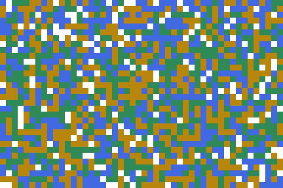
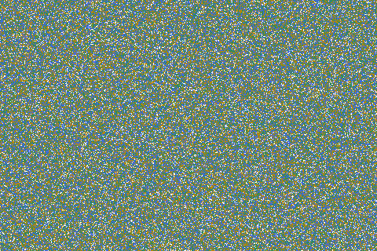
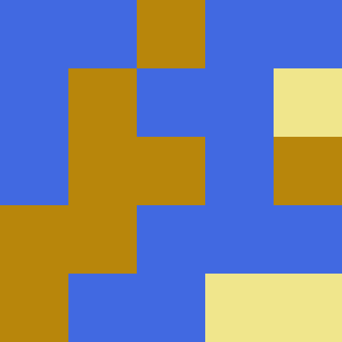

# Biome
Biome is a plane world generation tool written in Go (Golang).

# Installation
Installation is done using `go get`.
```
go get -u git@github.com:tomowarkar/biome.git
```
# Quick start
```
# assume the following codes in example.go file
$ cat example.go
```
### random map
```go
package main

import (
	"fmt"

	"github.com/tomowarkar/biome"
)

func main() {
	b := biome.NewWorld(5, 5)
	b.RandIntn(3, 0)
	b.Show()

	d := biome.NewDicts()
	d.Set(0, biome.PickColor("khaki"))
	d.Set(1, biome.PickColor("darkgoldenrod"))
	d.Set(2, biome.PickColor("royalblue"))
	fmt.Println(d)

	err := b.ToPng(100, d, "image")
	if err != nil {
		panic(err)
	}
}
```
```
# run example.go
$ go run example.go
```
### flactal
```go
package main

import (
	"time"
	"github.com/tomowarkar/biome"
)

func main() {
	world := biome.Flactal(32, 48, time.Now().UnixNano())
	d := biome.DefaultDicts()
	world.ToPng(10, d, "image")
}
```
## examples
|                                                    |                                                    |                                                     |
| -------------------------------------------------- | -------------------------------------------------- | --------------------------------------------------- |
|  |  |  |
|   |  |   |

# License
Biome is free and open-source software licensed under  the Boost Software License, Version 1.0.(See accompanying file LICENSE_1_0.txt or copy at http://www.boost.org/LICENSE_1_0.txt)

# Author 
|                                               |            |                                             |                                |
| --------------------------------------------- | ---------- | ------------------------------------------- | ------------------------------ |
|  | tomowarkar | [twitter](https://twitter.com/tomorrowSLog) | [blog](https://tomowarkar.com) |

