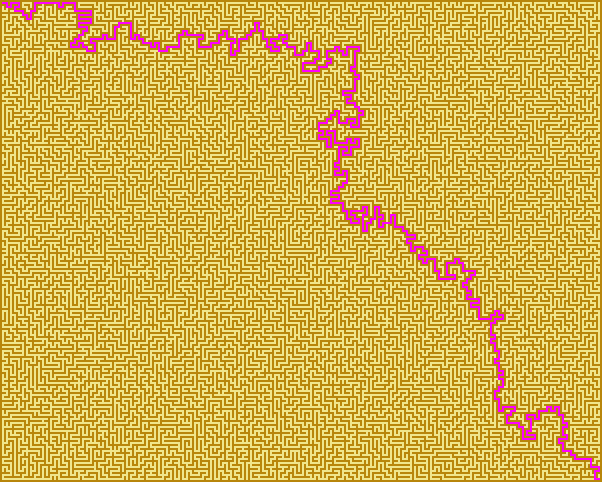

# Biome
Biome is a plane world generation tool written in Go (Golang).

# Installation
Installation is done using `go get`.
```
go get -u github.com/tomowarkar/biome
```

# Godoc
https://godoc.org/github.com/tomowarkar/biome

# Quick start
```
# assume the following codes in example.go file
$ cat example.go
```
### random map
```go
package main

import (
	"fmt"

	"github.com/tomowarkar/biome"
)

func main() {
	b := biome.NewWorld(5, 8)
	b.RandIntn(4, time.Now().UnixNano())
	b.Show()

	d := biome.NewDicts()
	d.Set(0, biome.Colors["khaki"])
	d.Set(1, biome.Colors["darkgoldenrod"])
	d.Set(2, biome.Colors["royalblue"])
	d.Set(3, biome.Colors["seagreen"])
	fmt.Println(d)

	err := b.ToPng(100, d, "image")
	if err != nil {
		panic(err)
	}
}
```
```
# run example.go
$ go run example.go
```
### flactal
```go
package main

import (
	"time"
	"github.com/tomowarkar/biome"
)

func main() {
	world := biome.Flactal(32, 48, time.Now().UnixNano())
	d := biome.DefaultDicts()
	world.ToPng(10, d, "image")
}
```
### maze
```go
package main

import (
	"github.com/tomowarkar/biome/maze"
)

func main() {
	m := maze.NewMaze(48, 60)
	m.StickDown(0)
	m.Solve()
	m.ToPng(10, "maze1")
	m.Digging(0)
	m.Solve()
	m.ToPng(10, "maze2")
}
```
## examples
|                                                    |                                                    |                                                     |
| -------------------------------------------------- | -------------------------------------------------- | --------------------------------------------------- |
|  |  |  |
|   |  |   |
|    |   |    |

# License
Biome is free and open-source software licensed under  the Boost Software License, Version 1.0.(See accompanying file LICENSE_1_0.txt or copy at http://www.boost.org/LICENSE_1_0.txt)

# Author 
|                                               |            |                                             |                                |
| --------------------------------------------- | ---------- | ------------------------------------------- | ------------------------------ |
|  | tomowarkar | [twitter](https://twitter.com/tomorrowSLog) | [blog](https://tomowarkar.com) |

